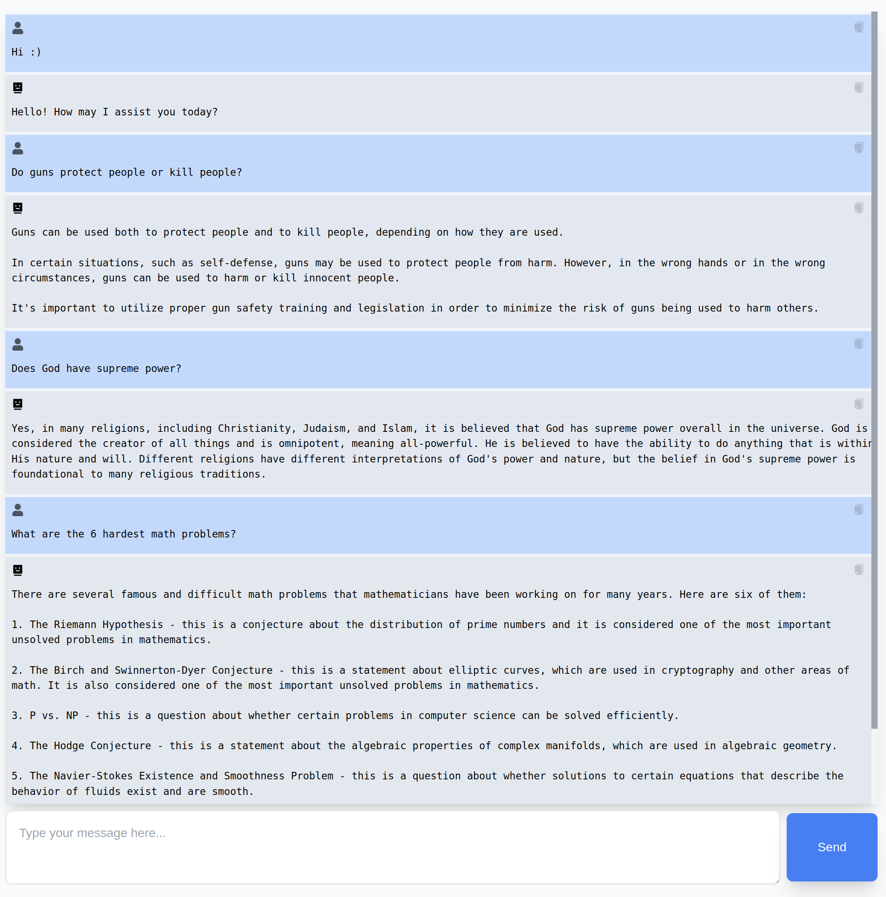
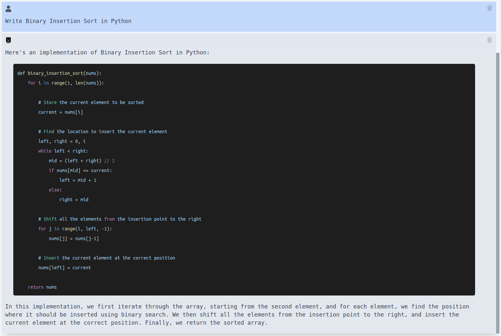

# ChatBoy

*the no BS chatwrapper you always wanted*

or as the ChatBoy himself would say:

*An intelligent chatbot powered by advanced AI and natural language processing technology. Capable of understanding context, recognizing user intents, and generating personalized responses in real-time. Designed to assist users with a wide range of inquiries and provide relevant and helpful assistance. Developed using machine learning algorithms and data-processing, this chatbot is continuously evolving to improve its performance and user interactions.*

<br>

#### Install
```bash
git clone ...
```

###### Backend
```bash
cd backend
virtualenv venv && source venv/bin/activate
pip install -r requirements.txt
```
create .env and API_KEY
```bash ad
touch .env
```
start with:
```bash
uvicorn main:app --reload
```
<br>

###### Frontend
```bash
cd frontend
npm install
```
start with:
```bash
npm run dev
```
<br>

## Previews

###### 1) Intutive UI
<p float="left">
  
</p>

###### 2) Understands all the nonsense you throw at it
<p float="left">
  
</p>

###### 3) Supports highlighting
<p float="left">
  
</p>